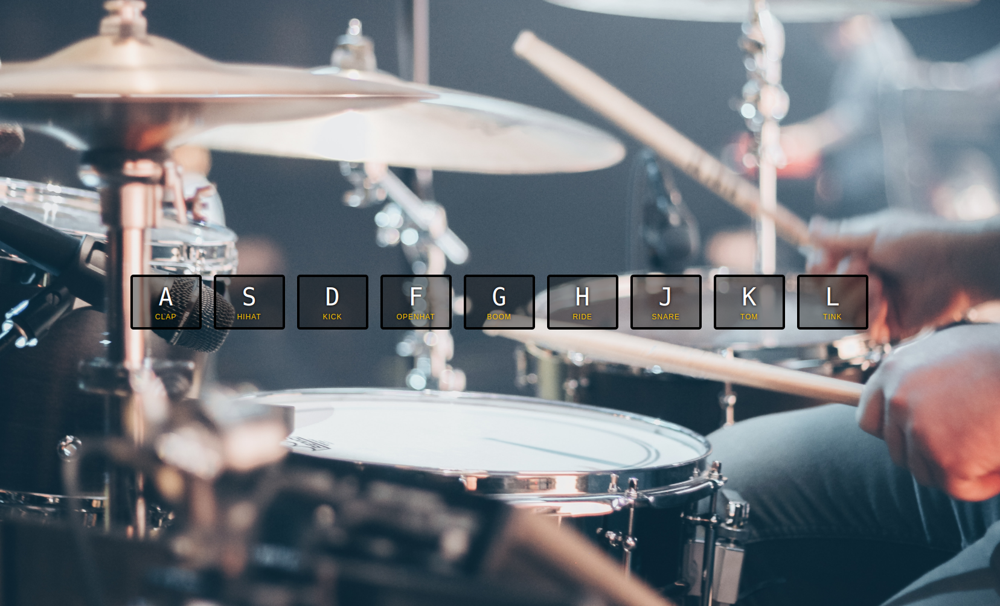

Welcome! 

Come join me on my journey of Wes Bos's 30 Day Vanilla JS Code Challenge! Where I build 30 things in 30 days with 30 tuturials~
  
### Day 1 Challenge of Javascript30

## Javascript Drum Kit

At the beginning of this challenge, it's just an HTML page that displays letters which corresponds with a key on the keyboard, and the name of the soundclip that should play when pressed. Goal for this challenge is when a user presses a corresponding key on the webpage, the soundclip should play everytime the key is pressed as well as highlight around the button.

### What I learned:
- addEventListener
- querySelector & querySelectorAll
- classList
- transitionend

Starter code from [Javascript 30 Challenge](https://github.com/wesbos/JavaScript30)